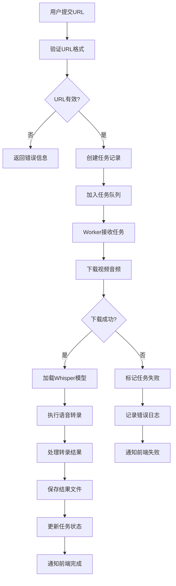
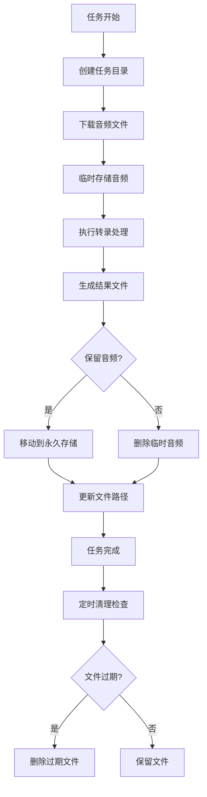

# Bili2Text Web 架构概览

## 🏗️ 系统架构

### 整体架构图

```
                    ┌─────────────────┐
                    │   用户浏览器    │
                    │   (Frontend)    │
                    └─────────┬───────┘
                              │ HTTP/WebSocket
                              ▼
                    ┌─────────────────┐
                    │   Nginx代理     │
                    │  (Load Balancer) │
                    └─────────┬───────┘
                              │
                              ▼
    ┌─────────────────────────────────────────────────────────┐
    │                  Web应用层                              │
    │  ┌─────────────┐  ┌─────────────┐  ┌─────────────┐     │
    │  │  FastAPI    │  │  WebSocket  │  │  静态文件   │     │
    │  │   服务器    │  │    服务     │  │    服务     │     │
    │  └─────────────┘  └─────────────┘  └─────────────┘     │
    └─────────────┬───────────────────────────────────────────┘
                  │
                  ▼
    ┌─────────────────────────────────────────────────────────┐
    │                  业务逻辑层                              │
    │  ┌─────────────┐  ┌─────────────┐  ┌─────────────┐     │
    │  │  任务管理   │  │  文件管理   │  │  转录引擎   │     │
    │  │   模块      │  │    模块     │  │    模块     │     │
    │  └─────────────┘  └─────────────┘  └─────────────┘     │
    └─────────────┬───────────────────────────────────────────┘
                  │
                  ▼
    ┌─────────────────────────────────────────────────────────┐
    │                  任务队列层                              │
    │  ┌─────────────┐  ┌─────────────┐  ┌─────────────┐     │
    │  │   Celery    │  │   Redis     │  │  Worker节点 │     │
    │  │   调度器    │  │   消息队列  │  │   (多个)    │     │
    │  └─────────────┘  └─────────────┘  └─────────────┘     │
    └─────────────┬───────────────────────────────────────────┘
                  │
                  ▼
    ┌─────────────────────────────────────────────────────────┐
    │                  数据存储层                              │
    │  ┌─────────────┐  ┌─────────────┐  ┌─────────────┐     │
    │  │   SQLite    │  │  文件系统   │  │   缓存层    │     │
    │  │   数据库    │  │   存储      │  │  (Redis)    │     │
    │  └─────────────┘  └─────────────┘  └─────────────┘     │
    └─────────────────────────────────────────────────────────┘
```

## 🔧 技术栈详解

### 前端技术栈

#### 核心技术
- **HTML5**: 语义化标记，支持现代Web标准
- **CSS3**: 响应式设计，Flexbox/Grid布局
- **JavaScript (ES6+)**: 现代JavaScript特性
- **WebSocket**: 实时双向通信

#### UI框架
- **Bootstrap 5**: 响应式CSS框架
- **Font Awesome**: 图标库
- **Chart.js**: 数据可视化（进度条、统计图表）

#### 前端架构
```
webapp/static/
├── css/
│   ├── bootstrap.min.css      # Bootstrap框架
│   ├── fontawesome.min.css    # 图标样式
│   └── custom.css             # 自定义样式
├── js/
│   ├── bootstrap.min.js       # Bootstrap交互
│   ├── chart.min.js           # 图表库
│   ├── websocket.js           # WebSocket通信
│   ├── task-manager.js        # 任务管理
│   ├── file-manager.js        # 文件操作
│   └── main.js                # 主要业务逻辑
└── templates/
    ├── base.html              # 基础模板
    ├── index.html             # 主页面
    ├── history.html           # 历史记录
    └── components/            # 组件模板
        ├── task-card.html
        ├── progress-bar.html
        └── file-list.html
```

### 后端技术栈

#### Web框架
- **FastAPI**: 现代Python Web框架
  - 自动API文档生成
  - 类型提示支持
  - 异步请求处理
  - WebSocket支持

#### 数据库
- **SQLite**: 轻量级关系数据库
  - 无需额外配置
  - 支持ACID事务
  - 适合单机部署
  - 支持并发读取

#### 任务队列
- **Celery**: 分布式任务队列
  - 异步任务处理
  - 任务状态跟踪
  - 失败重试机制
  - 支持多Worker

- **Redis**: 消息代理和缓存
  - 高性能内存数据库
  - 支持发布/订阅
  - 任务状态缓存
  - 会话存储

#### 核心依赖
```python
# requirements-web.txt
fastapi==0.104.1          # Web框架
uvicorn==0.24.0           # ASGI服务器
celery==5.3.4             # 任务队列
redis==5.0.1              # Redis客户端
sqlalchemy==2.0.23        # ORM框架
alembic==1.13.0           # 数据库迁移
pydantic==2.5.0           # 数据验证
websockets==12.0          # WebSocket支持
jinja2==3.1.2             # 模板引擎
python-multipart==0.0.6   # 文件上传支持
```

## 📊 数据模型设计

### 数据库表结构

#### 任务表 (tasks)
```sql
CREATE TABLE tasks (
    id VARCHAR(50) PRIMARY KEY,           -- 任务唯一ID
    url VARCHAR(500) NOT NULL,            -- 视频URL
    title VARCHAR(200),                   -- 视频标题
    status VARCHAR(20) NOT NULL,          -- 任务状态
    progress FLOAT DEFAULT 0,             -- 进度百分比
    model_name VARCHAR(20) NOT NULL,      -- 使用的模型
    created_at TIMESTAMP DEFAULT CURRENT_TIMESTAMP,
    started_at TIMESTAMP,
    completed_at TIMESTAMP,
    error_message TEXT,                   -- 错误信息
    result_file_path VARCHAR(500),        -- 结果文件路径
    audio_file_path VARCHAR(500),         -- 音频文件路径
    file_size INTEGER,                    -- 文件大小(字节)
    duration FLOAT,                       -- 音频时长(秒)
    options JSON                          -- 任务选项
);
```

#### 系统配置表 (settings)
```sql
CREATE TABLE settings (
    key VARCHAR(50) PRIMARY KEY,          -- 配置键
    value TEXT,                           -- 配置值
    description TEXT,                     -- 配置描述
    updated_at TIMESTAMP DEFAULT CURRENT_TIMESTAMP
);
```

#### 统计表 (statistics)
```sql
CREATE TABLE statistics (
    id INTEGER PRIMARY KEY AUTOINCREMENT,
    date DATE NOT NULL,                   -- 统计日期
    tasks_created INTEGER DEFAULT 0,     -- 创建任务数
    tasks_completed INTEGER DEFAULT 0,   -- 完成任务数
    tasks_failed INTEGER DEFAULT 0,      -- 失败任务数
    total_processing_time INTEGER DEFAULT 0, -- 总处理时间(秒)
    total_file_size BIGINT DEFAULT 0,    -- 总文件大小(字节)
    model_usage JSON                      -- 模型使用统计
);
```

### 数据模型类

#### Pydantic模型
```python
from pydantic import BaseModel
from datetime import datetime
from typing import Optional, Dict, Any
from enum import Enum

class TaskStatus(str, Enum):
    PENDING = "pending"
    DOWNLOADING = "downloading"
    TRANSCRIBING = "transcribing"
    COMPLETED = "completed"
    FAILED = "failed"
    CANCELLED = "cancelled"

class TaskCreate(BaseModel):
    url: str
    model_name: str = "medium"
    options: Optional[Dict[str, Any]] = {}

class TaskResponse(BaseModel):
    id: str
    url: str
    title: Optional[str]
    status: TaskStatus
    progress: float
    model_name: str
    created_at: datetime
    started_at: Optional[datetime]
    completed_at: Optional[datetime]
    error_message: Optional[str]
    result_file_path: Optional[str]
    audio_file_path: Optional[str]
    file_size: Optional[int]
    duration: Optional[float]
    
    class Config:
        from_attributes = True
```

## 🔄 业务流程设计

### 任务处理流程



### 文件管理流程



## 🔌 API设计模式

### RESTful API设计

#### 资源命名规范
- 使用名词复数形式：`/api/tasks/`
- 层级关系清晰：`/api/tasks/{id}/files/`
- 版本控制：`/api/v1/tasks/`

#### HTTP方法使用
- `GET`: 获取资源
- `POST`: 创建资源
- `PUT`: 完整更新资源
- `PATCH`: 部分更新资源
- `DELETE`: 删除资源

#### 响应格式标准
```json
{
  "success": true,
  "data": {
    // 实际数据
  },
  "message": "操作成功",
  "timestamp": "2024-01-15T14:30:22Z"
}
```

#### 错误响应格式
```json
{
  "success": false,
  "error": {
    "code": "TASK_NOT_FOUND",
    "message": "指定的任务不存在",
    "details": {}
  },
  "timestamp": "2024-01-15T14:30:22Z"
}
```

### WebSocket通信设计

#### 连接管理
```python
class ConnectionManager:
    def __init__(self):
        self.active_connections: Dict[str, List[WebSocket]] = {}
    
    async def connect(self, websocket: WebSocket, task_id: str):
        await websocket.accept()
        if task_id not in self.active_connections:
            self.active_connections[task_id] = []
        self.active_connections[task_id].append(websocket)
    
    async def disconnect(self, websocket: WebSocket, task_id: str):
        self.active_connections[task_id].remove(websocket)
    
    async def send_task_update(self, task_id: str, data: dict):
        if task_id in self.active_connections:
            for connection in self.active_connections[task_id]:
                await connection.send_json(data)
```

#### 消息格式
```json
{
  "type": "task_update",
  "task_id": "task_123456",
  "data": {
    "status": "transcribing",
    "progress": 45.5,
    "message": "正在转录音频...",
    "current_stage": "processing_segment_15_of_20"
  },
  "timestamp": "2024-01-15T14:30:22Z"
}
```

## 🔒 安全架构

### 认证和授权

#### API密钥认证
```python
from fastapi import HTTPException, Depends
from fastapi.security import HTTPBearer

security = HTTPBearer()

async def verify_api_key(token: str = Depends(security)):
    if not verify_token(token.credentials):
        raise HTTPException(
            status_code=401,
            detail="Invalid API key"
        )
    return token.credentials
```

#### 请求限制
```python
from slowapi import Limiter
from slowapi.util import get_remote_address

limiter = Limiter(key_func=get_remote_address)

@app.post("/api/tasks/")
@limiter.limit("10/minute")
async def create_task(request: Request, task_data: TaskCreate):
    # 任务创建逻辑
    pass
```

### 输入验证

#### URL验证
```python
import re
from urllib.parse import urlparse

def validate_bilibili_url(url: str) -> bool:
    patterns = [
        r'https?://www\.bilibili\.com/video/BV[\w]+',
        r'https?://b23\.tv/[\w]+',
        r'BV[\w]+'
    ]
    return any(re.match(pattern, url) for pattern in patterns)
```

#### 文件安全
```python
import os
from pathlib import Path

def secure_filename(filename: str) -> str:
    # 移除危险字符
    filename = re.sub(r'[^\w\-_\.]', '', filename)
    # 限制文件名长度
    return filename[:100]

def validate_file_path(file_path: str, base_dir: str) -> bool:
    # 防止路径遍历攻击
    abs_path = os.path.abspath(file_path)
    abs_base = os.path.abspath(base_dir)
    return abs_path.startswith(abs_base)
```

## 📈 性能优化策略

### 数据库优化

#### 索引策略
```sql
-- 任务查询优化
CREATE INDEX idx_tasks_status ON tasks(status);
CREATE INDEX idx_tasks_created_at ON tasks(created_at);
CREATE INDEX idx_tasks_user_id ON tasks(user_id);

-- 复合索引
CREATE INDEX idx_tasks_status_created ON tasks(status, created_at);
```

#### 连接池配置
```python
from sqlalchemy import create_engine
from sqlalchemy.pool import QueuePool

engine = create_engine(
    DATABASE_URL,
    poolclass=QueuePool,
    pool_size=10,
    max_overflow=20,
    pool_pre_ping=True,
    pool_recycle=3600
)
```

### 缓存策略

#### Redis缓存
```python
import redis
from functools import wraps

redis_client = redis.Redis(host='localhost', port=6379, db=0)

def cache_result(expire_time=3600):
    def decorator(func):
        @wraps(func)
        async def wrapper(*args, **kwargs):
            cache_key = f"{func.__name__}:{hash(str(args) + str(kwargs))}"
            cached = redis_client.get(cache_key)
            if cached:
                return json.loads(cached)
            
            result = await func(*args, **kwargs)
            redis_client.setex(
                cache_key, 
                expire_time, 
                json.dumps(result, default=str)
            )
            return result
        return wrapper
    return decorator
```

### 异步处理优化

#### 任务队列配置
```python
# celery_config.py
broker_url = 'redis://localhost:6379/0'
result_backend = 'redis://localhost:6379/0'

task_serializer = 'json'
accept_content = ['json']
result_serializer = 'json'
timezone = 'UTC'
enable_utc = True

# 任务路由
task_routes = {
    'webapp.tasks.transcription_tasks.transcribe_audio': {'queue': 'transcription'},
    'webapp.tasks.download_tasks.download_video': {'queue': 'download'},
}

# Worker配置
worker_prefetch_multiplier = 1
task_acks_late = True
worker_max_tasks_per_child = 1000
```

## 🔍 监控和日志

### 应用监控

#### 健康检查
```python
@app.get("/health")
async def health_check():
    return {
        "status": "healthy",
        "timestamp": datetime.utcnow(),
        "version": app.version,
        "database": await check_database_health(),
        "redis": await check_redis_health(),
        "workers": await check_worker_health()
    }
```

#### 性能指标
```python
import time
from prometheus_client import Counter, Histogram, generate_latest

REQUEST_COUNT = Counter('requests_total', 'Total requests', ['method', 'endpoint'])
REQUEST_LATENCY = Histogram('request_duration_seconds', 'Request latency')

@app.middleware("http")
async def add_process_time_header(request: Request, call_next):
    start_time = time.time()
    response = await call_next(request)
    process_time = time.time() - start_time
    
    REQUEST_COUNT.labels(
        method=request.method, 
        endpoint=request.url.path
    ).inc()
    REQUEST_LATENCY.observe(process_time)
    
    response.headers["X-Process-Time"] = str(process_time)
    return response
```

### 日志系统

#### 结构化日志
```python
import structlog
import logging

# 配置结构化日志
structlog.configure(
    processors=[
        structlog.stdlib.filter_by_level,
        structlog.stdlib.add_logger_name,
        structlog.stdlib.add_log_level,
        structlog.stdlib.PositionalArgumentsFormatter(),
        structlog.processors.TimeStamper(fmt="iso"),
        structlog.processors.StackInfoRenderer(),
        structlog.processors.format_exc_info,
        structlog.processors.UnicodeDecoder(),
        structlog.processors.JSONRenderer()
    ],
    context_class=dict,
    logger_factory=structlog.stdlib.LoggerFactory(),
    wrapper_class=structlog.stdlib.BoundLogger,
    cache_logger_on_first_use=True,
)

logger = structlog.get_logger()

# 使用示例
logger.info(
    "Task created",
    task_id="task_123456",
    url="https://www.bilibili.com/video/BV15N4y1J7CA",
    model="medium",
    user_ip="192.168.1.100"
)
```

## 🚀 扩展性设计

### 水平扩展

#### 负载均衡配置
```nginx
upstream bili2text_backend {
    server 127.0.0.1:8000 weight=1;
    server 127.0.0.1:8001 weight=1;
    server 127.0.0.1:8002 weight=1;
}

server {
    listen 80;
    location / {
        proxy_pass http://bili2text_backend;
        proxy_set_header Host $host;
        proxy_set_header X-Real-IP $remote_addr;
    }
}
```

#### 分布式Worker
```python
# 不同类型的Worker
celery -A webapp.tasks.celery_app worker -Q download --hostname=download-worker@%h
celery -A webapp.tasks.celery_app worker -Q transcription --hostname=transcription-worker@%h
celery -A webapp.tasks.celery_app worker -Q cleanup --hostname=cleanup-worker@%h
```

### 插件系统

#### 插件接口定义
```python
from abc import ABC, abstractmethod

class TranscriptionPlugin(ABC):
    @abstractmethod
    async def transcribe(self, audio_path: str, options: dict) -> str:
        pass
    
    @abstractmethod
    def get_supported_formats(self) -> List[str]:
        pass

class WhisperPlugin(TranscriptionPlugin):
    async def transcribe(self, audio_path: str, options: dict) -> str:
        # Whisper转录实现
        pass
    
    def get_supported_formats(self) -> List[str]:
        return ['mp3', 'm4a', 'wav', 'flac']
```

#### 插件注册机制
```python
class PluginManager:
    def __init__(self):
        self.plugins = {}
    
    def register_plugin(self, name: str, plugin: TranscriptionPlugin):
        self.plugins[name] = plugin
    
    def get_plugin(self, name: str) -> TranscriptionPlugin:
        return self.plugins.get(name)
    
    def list_plugins(self) -> List[str]:
        return list(self.plugins.keys())

# 全局插件管理器
plugin_manager = PluginManager()
plugin_manager.register_plugin('whisper', WhisperPlugin())
```

---

这个架构概览文档详细描述了Bili2Text Web应用的技术架构、设计模式和实现细节。通过模块化设计和现代技术栈，确保了系统的可扩展性、可维护性和高性能。